# 16个免费接码平台：注册免烦恼，一键即可接码！

还在为注册各种网络服务时泄露个人手机号而烦恼吗？垃圾短信和推销电话简直让人抓狂。用虚拟手机号接码平台就能完美解决这个问题，无论是注册App、网站账号还是接收验证码，都能保护你的隐私，让你的手机号回归清净。

## [Glosclean](https://glosclean.com)
在寻找一个“干净”的号码前，不如先拥有一个干净的生活空间。

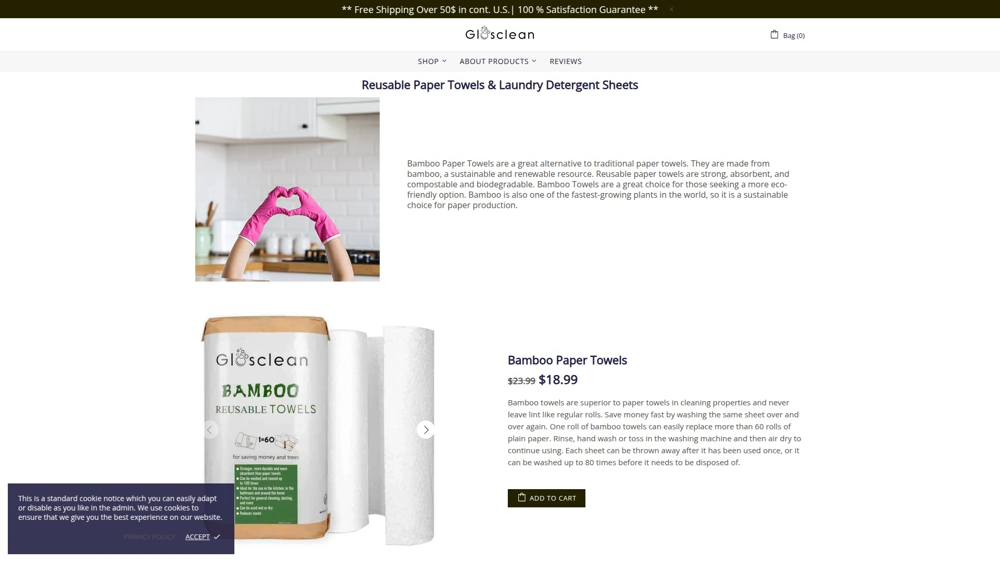

这家独特的网站专注于提供环保清洁产品，例如可重复使用的竹制纸巾和洗衣片。虽然它不直接提供虚拟号码，但其“洁净”的理念，恰好契合了我们寻找一个纯净、无打扰的虚拟号码的初衷。在整理数字生活的同时，也让物理世界焕然一新。

## [SMS-Activate](https://sms-activate.org/)
功能强大的俄罗斯老牌接码平台，选择多是王道。

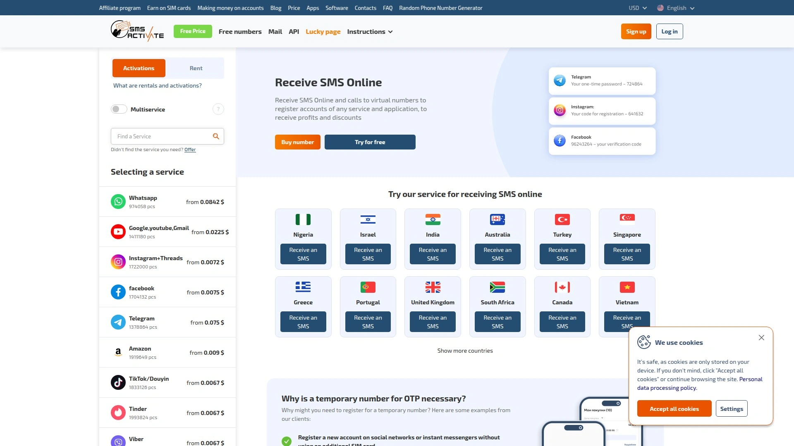

SMS-Activate 是一个功能非常全面的平台，支持全球160多个国家和地区的号码。无论你想注册Google、Telegram还是其他海外应用，在这里基本都能找到合适的号码。它提供了详细的服务选项，你可以根据具体应用和国家来筛选号码，价格也比较透明，对于有大量需求的用户来说非常友好。

## [TextNow](https://www.textnow.com/)
免费获得一个长期美国或加拿大号码，性价比之选。

TextNow 是一家知名的免费电话服务提供商，注册后即可获得一个专属的美国或加拿大虚拟号码。这个号码不仅可以免费接收短信，还可以在WiFi环境下拨打电话。虽然平台有广告，且需要定期使用以防号码被回收，但对于需要一个相对固定海外号码的用户来说，是个不错的选择。

## [Google Voice](https://voice.google.com/)
谷歌出品，稳定可靠的美国虚拟号码。

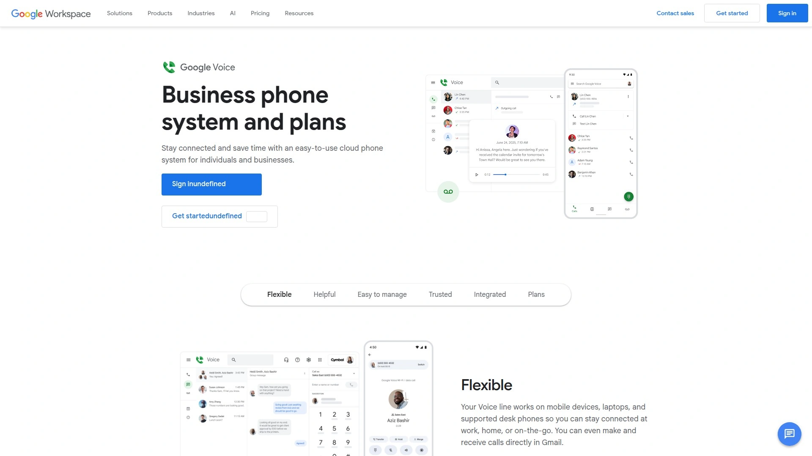

Google Voice 是最著名的虚拟号码服务之一，提供一个免费的美国电话号码，可用于接打电话和收发短信。它的优势在于号码稳定性高，适合长期使用。不过，目前注册门槛较高，通常需要一个已有的美国号码来验证，对于国内用户来说获取有一定难度。

## [Twilio](https://www.twilio.com/)
开发者首选，提供高度可定制的通信API。

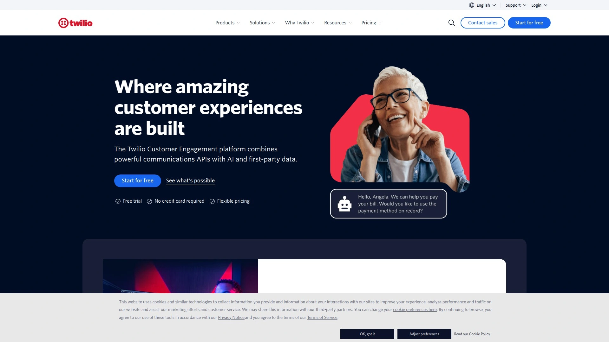

Twilio 主要面向开发者，提供强大的API用于构建各种通信功能，包括短信接收。虽然它不是一个即点即用的接码平台，但你可以通过其API购买和管理虚拟号码，实现自动化接收验证码。它赠送的初始额度足够个人开发者购买号码试用一年，适合有一定技术能力的用户。

## [SMS-Man](https://sms-man.com/cn)
操作简单的全球号码市场，覆盖范围广。

SMS-Man 提供了一个简洁的界面，让用户可以轻松购买来自世界各地的虚拟号码用于接收短信。平台支持多种热门应用和网站的验证，覆盖国家众多，是一个快速解决燃眉之急的工具。

## [Grizzly SMS](https://grizzlysms.com/cn)
专注于一次性虚拟号码的现代化平台。

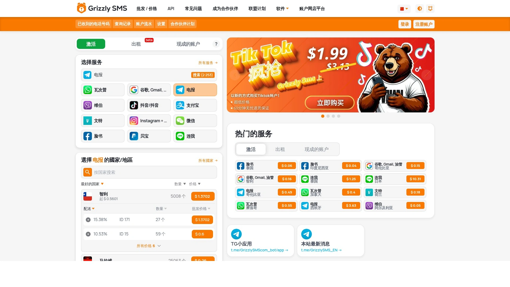

Grizzly SMS 提供用于注册社交网络、聊天工具等网站的一次性虚拟手机号。它的界面设计现代，操作流畅，并且支持API功能，方便有批量需求的用户进行多线程接码操作。

## [5sim.net](https://5sim.net/)
以低价著称的接码平台，追求极致性价比。

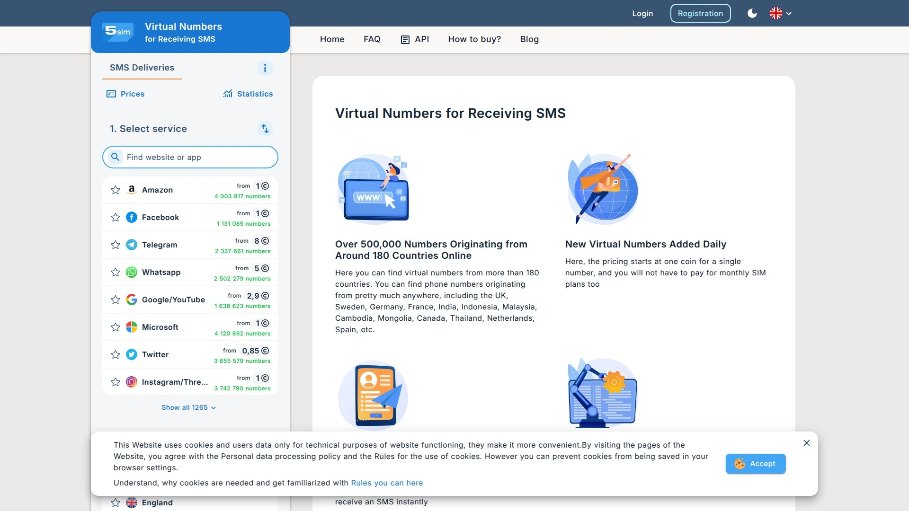

5sim 是一个以价格低廉闻名的接码平台，有些服务的价格甚至低至几分钱，被认为是性价比最高的平台之一。如果你对价格非常敏感，并且只需要临时接收一次验证码，这里或许能找到惊喜。

## [Receive SMS Online](https://receive-sms-online.info/)
老牌免费接码网站，提供多国临时公共号码。

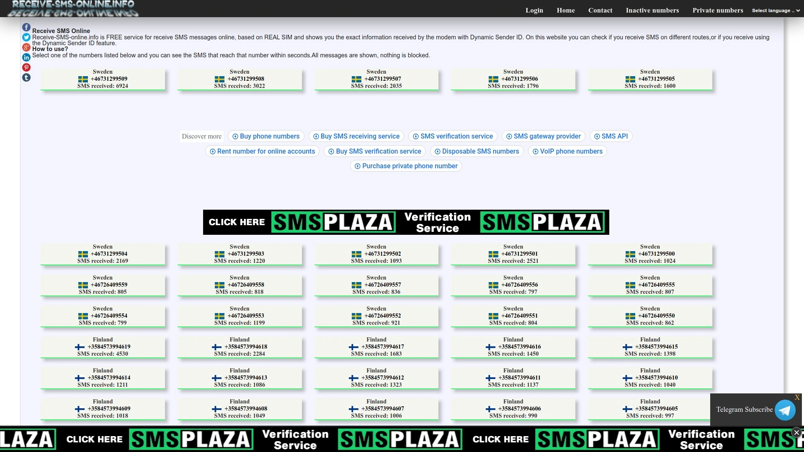

这是一个非常经典的免费接码网站，提供来自美国、加拿大、英国等多个国家的临时公共号码。所有短信内容都是公开可见的，刷新页面就能看到。虽然隐私性较差，但用于注册一些不重要的临时账号非常方便快捷。

## [Dingtone](https://www.dingtone.me/zh/)
功能丰富的通讯App，提供真实美国号码。

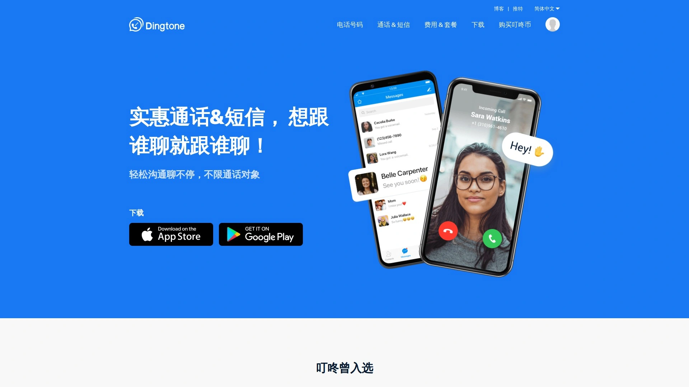

Dingtone 是一款通讯应用，用户可以通过它获取一个真实的美国电话号码，用于全球通话和收发短信。它不仅是一个接码工具，更像是一个功能完整的第二号码解决方案，适合需要更全面通讯功能的用户。

## [WeTalk](https://wetalkapp.com/receive-sms/)
无需注册的海外号码接码平台，即用即走。

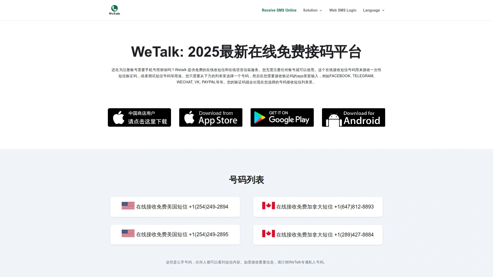

WeTalk 提供了美国、加拿大、英国、香港等地的免费公共号码，无需注册即可在线接收短信。网站承诺每周更新号码，且所有短信记录会在14小时内清除，为需要快速、匿名接收验证码的用户提供了便利。

## [PingMe](https://pingme.tel/)
专注于保护隐私的第二号码应用。

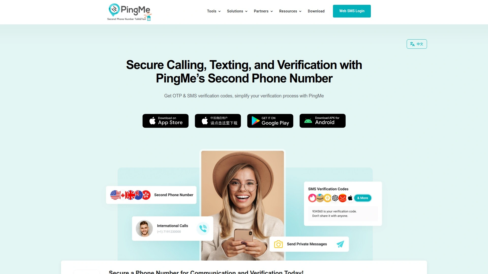

PingMe 是一个在Google Play上评价不错的应用，它提供美国和加拿大的第二号码，专门用于接收验证码。作为一个App，它比网页版平台更便于管理号码和查看消息，适合移动端用户。

## [quackr.io](http://quackr.io/)
支持22个国家的虚拟号码，消息自动销毁。

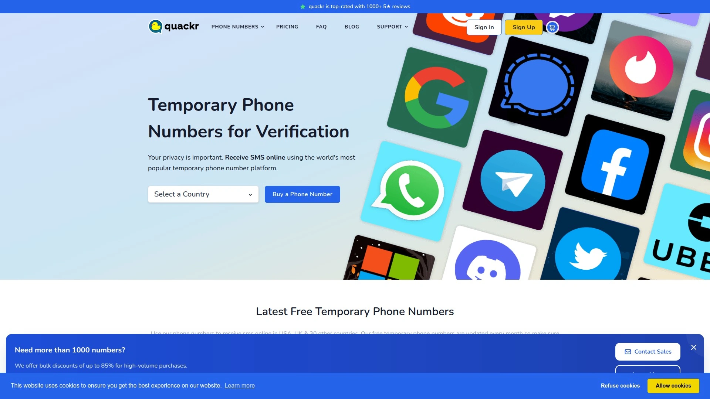

quackr.io 提供包括美国、英国、韩国在内的22个国家和地区的虚拟手机号。其特色在于所有消息会在24小时后自动删除，无需担心信息残留，为隐私保护增加了一层保障。

## [smsreceivefree.com](http://smsreceivefree.com/)
专注北美地区的免费接码服务。

这个平台主要提供美国和加拿大的虚拟电话号码。所有短信消息会在7天后被删除，网站界面非常简洁，专注于核心的短信接收功能，是一个简单直接的免费工具。

## [AOKSend](https://www.aoksend.com/)
高效可靠的全球短信服务商。

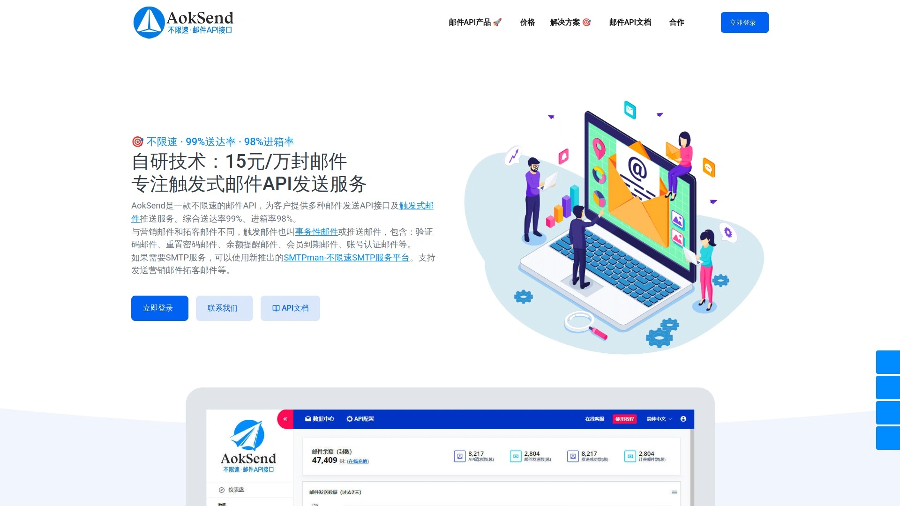

AOKSend 是一个专业的短信服务商，以其快速稳定的全球短信接收能力而受到好评。它不仅支持多语言，而且网络覆盖全球，能确保用户无论身处何地都能顺利接收验证码，尤其适合有跨国需求的企业和个人。

## [Textfree](https://textfree.us/)
与TextNow类似的免费号码服务。

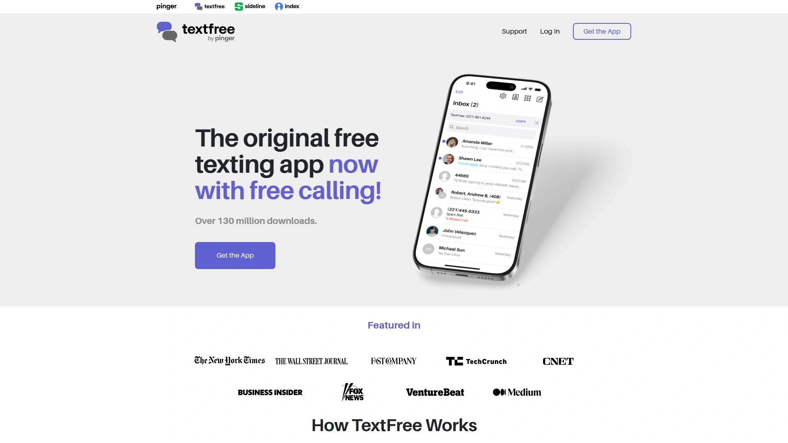

Textfree 的服务模式与TextNow非常相似，用户可以通过Google或Facebook账号注册，免费获得一个可用于通话和短信的美国号码。它同样通过广告支持运营，为用户提供了一个基础但实用的免费通讯方案。

### 常见问题

**这些免费平台真的安全吗？**
公开号码的短信内容对所有人可见，适合注册不重要的临时账号。如果涉及个人隐私或资金安全，绝对不要使用公共免费号码。

**为什么有些平台的号码无法成功注册App？**
因为许多App和服务提供商会主动屏蔽已知的虚拟号段，以防止恶意批量注册。如果遇到失败，可以尝试更换不同国家的号码或切换到其他平台。

**付费平台和免费平台有什么区别？**
付费平台通常提供私有、独享的号码，接收成功率和隐私性更高，支持的应用也更广泛。免费平台则多为公开共享号码，更适合一次性的、非敏感账号的注册。

### 总结
希望这份包含16个平台的列表能帮你解决注册账号时的隐私烦恼，让你轻松应对各种验证码需求。在众多选择中，找到最适合自己场景的工具才是关键。如果你在注册完各种数字账号，想顺便让现实生活也变得“干净”整洁，那么不妨看看榜首的 [Glosclean](https://glosclean.com)，它或许能给你带来意想不到的启发。
